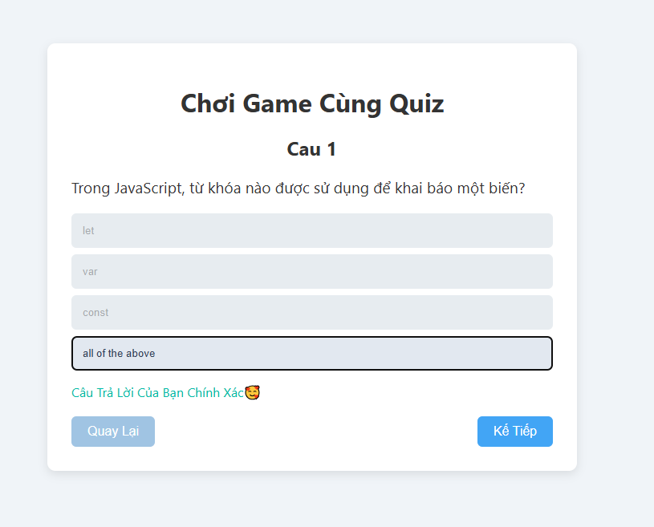
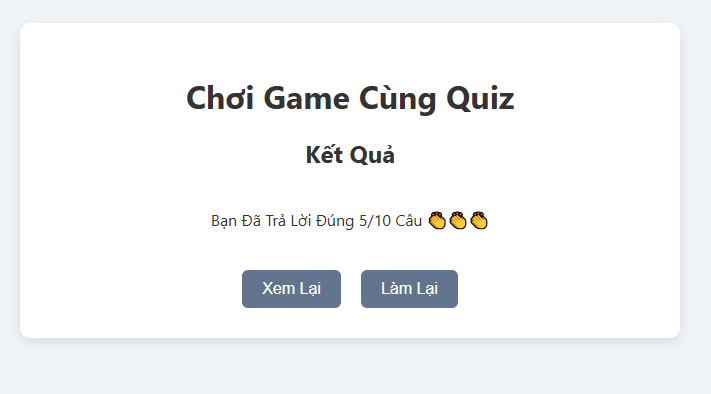

# 🧠 Trò chơi Quiz bằng ReactJS

Đây là trò chơi Quiz đơn giản được xây dựng bằng ReactJS, cho phép người chơi trả lời các câu hỏi trắc nghiệm
và xem điểm số sau khi hoàn thành bài quiz.

Dự án được thực hiện nhằm luyện tập React cơ bản như component và các hook: useState, useEffect.

---

## 🚀 Công nghệ sử dụng

- ReactJS (Hooks: useState, useEffect)
- JavaScript (ES6)
- HTML5
- CSS3

---

## ✨ Chức năng chính

- Hiển thị câu hỏi trắc nghiệm
- Chọn 1 đáp án cho mỗi câu
- Đánh dấu đáp án đã chọn
- Chuyển câu hỏi (Next / Previous)
- Hiển thị kết quả cuối cùng
- Làm lại bài quiz

---

## 🖼 Hình ảnh demo

### Màn hình làm bài


### Màn hình kết quả



---

## ⚙️ Hướng dẫn cài đặt và chạy project

### Bước 1: Clone project

```bash
git clone https://github.com/BaoLong05/react-quiz-game.git
```
### Bước 2: Cài đặt thư viện

```bash
npm install
```
### Bước 3: Chạy project

```bash
npm run dev
```
